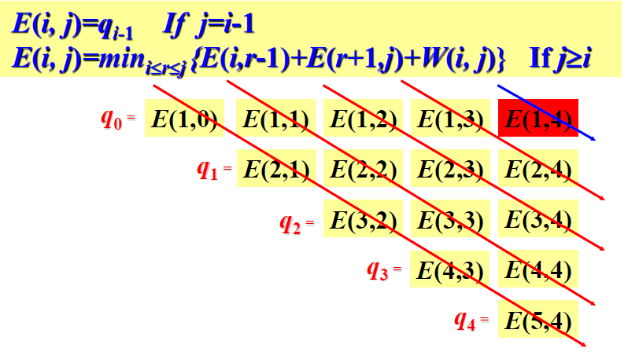

# 动态规划
本质：将分治结果保存，防止重复计算

## 条件

1. 优化子结构：问题的优化解包含子问题的优化解
2. 重复子问题：很多子问题的解被多次使用
## 设计步骤

1. 分析优化解的结构
2. 递归定义优化解的代价
3. 自底而上地计算优化解的代价并保存
4. 构造优化解

## 最长公共子序列

1. 公共子序列的判定（Rabin-Karp）
2. C\[i,j\]=max(c\[i,j-1\],c\[i-1,j\])

## 矩阵链乘法

矩阵乘法满足结合律

pxq,qxr的矩阵相乘代价为pxqxr

### 优化子结构

具有子问题的重复性(Aij:i到j的乘积花费的代价)

A(i,j)=A(i,k)+A(k+1,j)+p(i-1)p(k)p(j)

## 01背包问题

输入：物品的重量w和价值v
输出：最大价值的物品

### 优化子结构

m(i,j):容量为j，可选物品为i-n的最大价值

m(i,j)=max(m(i+1,j),m(i+1,j-wi)+vi)

## 最优搜索二叉树

在树中的真节点：k1-kn,搜索概率p1,pn

不在树中的伪节点：d0-dn，搜索概率为q0-qn

定义e\[i,j\]为搜索一棵包含关键字ki，……，kj的最优二叉查找树的期望代价

当j=i-1时，说明此时只有虚拟键di-1，故e\[i,i-1\] = qi-1

w(i,j)=w(i,r-1)+w(r+1,j)+pr

包含ki-kj的概率和为

w(i,j)=w(i,j-1)+pi+pj

e(i,j)=e(i,r-1)+e(r+1,j)+w(i,j)

