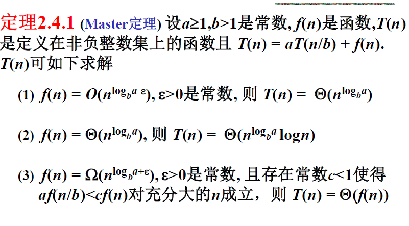
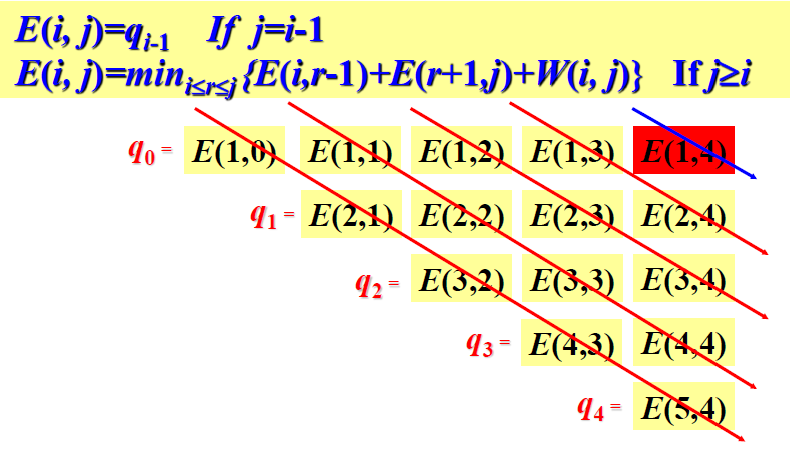
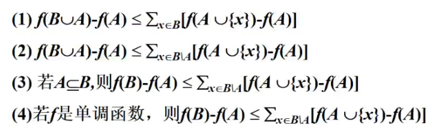

- [算法](#算法)
  - [正确性](#正确性)
    - [证明](#证明)
      - [循环不变量方法](#循环不变量方法)
  - [复杂性](#复杂性)
    - [输入的大小](#输入的大小)
    - [时间复杂性](#时间复杂性)
    - [最坏复杂性，最小复杂性，平均复杂性](#最坏复杂性最小复杂性平均复杂性)
    - [数学函数](#数学函数)
      - [同阶函数](#同阶函数)
      - [低阶函数](#低阶函数)
      - [高阶函数](#高阶函数)
      - [严格低阶](#严格低阶)
      - [严格高阶](#严格高阶)
      - [函数阶的性质](#函数阶的性质)
      - [Floor&Ceiling](#floorceiling)
      - [和式的估计与界限](#和式的估计与界限)
      - [求和递归方程](#求和递归方程)
      - [变量替换](#变量替换)
- [分治算法](#分治算法)
  - [设计](#设计)
  - [最邻近点问题](#最邻近点问题)
    - [一维](#一维)
    - [二维](#二维)
  - [凸包](#凸包)
    - [蛮力算法](#蛮力算法)
    - [Grahan-Scan算法](#grahan-scan算法)
    - [分治](#分治)
  - [中位数选取](#中位数选取)
- [动态规划](#动态规划)
  - [条件](#条件)
  - [设计步骤](#设计步骤)
  - [最长公共子序列](#最长公共子序列)
  - [矩阵链乘法](#矩阵链乘法)
    - [优化子结构](#优化子结构)
  - [01背包问题](#01背包问题)
    - [优化子结构](#优化子结构-1)
  - [最优搜索二叉树](#最优搜索二叉树)
- [搜索策略](#搜索策略)
  - [搜索树](#搜索树)
    - [8魔方问题](#8魔方问题)
    - [哈密顿环](#哈密顿环)
  - [基础搜索](#基础搜索)
  - [爬山策略](#爬山策略)
  - [最佳优先](#最佳优先)
  - [分支限界](#分支限界)
    - [工作分配问题](#工作分配问题)
    - [哈密顿环](#哈密顿环-1)
    - [背包问题](#背包问题)
  - [A*算法](#a算法)
    - [最短路径问题](#最短路径问题)
- [贪心算法](#贪心算法)
  - [基本思想](#基本思想)
  - [产生优化解的条件](#产生优化解的条件)
  - [相容活动](#相容活动)
    - [贪心思想](#贪心思想)
  - [哈希编码](#哈希编码)
    - [贪心思想](#贪心思想-1)
  - [最小生成树](#最小生成树)
    - [基本思想](#基本思想-1)
  - [拟阵](#拟阵)
    - [条件](#条件-1)
    - [性质](#性质)
    - [应用](#应用)
      - [算法](#算法-1)
        - [贪心选择性](#贪心选择性)
      - [实例](#实例)
      - [单位时间任务调动问题](#单位时间任务调动问题)
- [近似算法](#近似算法)
  - [基本定义](#基本定义)
    - [Ratio Bound](#ratio-bound)
    - [相对误差](#相对误差)
    - [相对误差界](#相对误差界)
    - [近似模式](#近似模式)
  - [组合优化](#组合优化)
    - [顶点覆盖问题](#顶点覆盖问题)
    - [装箱问题](#装箱问题)
    - [最短并行调度问题](#最短并行调度问题)
    - [哈密顿环问题](#哈密顿环问题)
    - [子集和](#子集和)
      - [指数时间算法](#指数时间算法)
      - [近似算法](#近似算法-1)
  - [贪心策略](#贪心策略)
    - [集合覆盖问题](#集合覆盖问题)
      - [基本思想](#基本思想-2)
    - [不相交路径问题](#不相交路径问题)
      - [贪心思想](#贪心思想-2)
      - [近似比](#近似比)
    - [亚模函数](#亚模函数)
      - [性质](#性质-1)
      - [亚模函数的最大化贪心算法](#亚模函数的最大化贪心算法)
  - [局部优化](#局部优化)
    - [关键点](#关键点)
  - [动态规划](#动态规划-1)
    - [近似策略](#近似策略)
    - [01背包问题的完全多项式近似模式](#01背包问题的完全多项式近似模式)
    - [bin-pack问题](#bin-pack问题)
      - [解决方案](#解决方案)
  - [线性规划](#线性规划)
    - [对偶问题](#对偶问题)
      - [近似条件](#近似条件)
      - [最大流问题](#最大流问题)
        - [顶点覆盖问题舍入法](#顶点覆盖问题舍入法)
        - [集合覆盖问题原偶模式](#集合覆盖问题原偶模式)
- [在线算法](#在线算法)
  - [在线算法特点](#在线算法特点)
    - [实时最小生成树问题](#实时最小生成树问题)
  - [在线算法的性能](#在线算法的性能)
      - [随机算法](#随机算法)
    - [凸多边形](#凸多边形)

# 算法
算法是满足下列条件的计算
1. 有穷性/终止性：有限步内停止
2. 确定性：每一步有严格定义
3. 能行性：每一步动作都能精确执行
4. 输入：有满足约束条件的输入
5. 输出：满足给定约束的结果
## 正确性

一个算法是正确的：对每一个输入都最终定制，而却产生正确的输出

### 证明
#### 循环不变量方法

证明主要结构是循环结构的算法的正确性

循环不变量：数据或算法结构的关键性质

## 复杂性

### 输入的大小

矩阵问题：矩阵的维数

图论问题：图的边数/结点数

### 时间复杂性

输入大小的函数，原子大小的步数

### 最坏复杂性，最小复杂性，平均复杂性

平均复杂性：输入出现的概率

### 数学函数

#### 同阶函数

#### 低阶函数

#### 高阶函数

#### 严格低阶

#### 严格高阶

#### 函数阶的性质

1. 传递性
2. 自反性
3. 对称性
4. 反对称性

#### Floor&Ceiling

#### 和式的估计与界限

1. 线和性

#### 求和递归方程

Master定理

#### 变量替换

替换为已知的方程求解

# 分治算法

## 设计

1. 划分为多个子问题
2. 求解各子问题
3. 合并子问题

## 最邻近点问题

输入：Euclidean空间上的n个点的集合Q

输出：最近的两个点

### 一维

1. 排序
2. 分治

    1. 分解：把原数据集均分
    2. 求解：得到当前数据集中最近的点
    3. 合并：在两个数据对和两个集合之间中找到最近的数据对

### 二维

分治：

1. 分解：分别按x轴y轴排序，均分
2. 求解：从分解完的数据中得到最近的数据对
3. 合并：临界区中，一个数据在邻域最多只有六个数据，比较并合并

## 凸包

输入：平面上n个点的集合Q
输出：CH（Q）（凸多边形）

### 蛮力算法

1. 三角形判别点（四重循环）（ax+by-c=0）

$$ a=y_2-y_1,b=x_2-x_1,c=x_1y_2-y_1x_2 $$

2. 按顺序输出

### Grahan-Scan算法

思想：极坐标下按照极角大小排序，逆时针漫游，除去非凸包的点

利用栈除去非左移动的点（当前，前一个，下一个构成三角形，抛出当前节点）

### 分治

1. 分解：按x轴均分
2. 计算：计算当前的凸包
3. 合并：逆时针ch(Ql)逆时针ch(QR)顺时针ch(Qr)合并时使用Grahan-Scan算法

## 中位数选取

二路归并

# 动态规划
本质：将分治结果保存，防止重复计算

## 条件

1. 优化子结构：问题的优化解包含子问题的优化解
2. 重复子问题：很多子问题的解被多次使用
## 设计步骤

1. 分析优化解的结构
2. 递归定义优化解的代价
3. 自底而上地计算优化解的代价并保存
4. 构造优化解

## 最长公共子序列

1. 公共子序列的判定（Rabin-Karp）
2. C\[i,j\]=max(c\[i,j-1\],c\[i-1,j\])

## 矩阵链乘法

矩阵乘法满足结合律

pxq,qxr的矩阵相乘代价为pxqxr

### 优化子结构

具有子问题的重复性(Aij:i到j的乘积花费的代价)

A(i,j)=A(i,k)+A(k+1,j)+p(i-1)p(k)p(j)

## 01背包问题

输入：物品的重量w和价值v
输出：最大价值的物品

### 优化子结构

m(i,j):容量为j，可选物品为i-n的最大价值

m(i,j)=max(m(i+1,j),m(i+1,j-wi)+vi)

## 最优搜索二叉树

在树中的真节点：k1-kn,搜索概率p1,pn

不在树中的伪节点：d0-dn，搜索概率为q0-qn

定义e\[i,j\]为搜索一棵包含关键字ki，……，kj的最优二叉查找树的期望代价

当j=i-1时，说明此时只有虚拟键di-1，故e\[i,i-1\] = qi-1

w(i,j)=w(i,r-1)+w(r+1,j)+pr

包含ki-kj的概率和为

w(i,j)=w(i,j-1)+pi+pj

e(i,j)=e(i,r-1)+e(r+1,j)+w(i,j)

# 搜索策略

## 搜索树

输入：n个布尔变量的k个析取布尔式

输出：一种赋值，所有析取式皆为真

### 8魔方问题

### 哈密顿环

## 基础搜索

1. 广度优先
2. 深度优先

## 爬山策略

使用贪心方法优化深度优先，使用启发式

启发式测度函数：f(n)=W(n)

## 最佳优先

所有的评价函数构成一个小头堆

1. 结合深度优先和广度有限
2. 从所有的评价函数中选取最小值
3. 有全局优化概念

但不能解决优化问题
## 分支限界

计算代价的上下界，剪除不可能产生优化解的分支

### 工作分配问题

输入：工人集合，工作集合，工作代价矩阵

输出：工作分配矩阵

### 哈密顿环

### 背包问题

贪心得到上界

## A*算法

f*(n)=g(n)+h(n):节点n的代价

g(n)树根到n的代价

h*(n)n到目标节点的优化路径的代价

h(n)h*(n)的估计：h(n)<=h*(n)总为真

### 最短路径问题

# 贪心算法

## 基本思想

每一步都选择最优的选择

## 产生优化解的条件

1. 贪心选择性：全局优化解可以通过局部优化选择得到
2. 优化子结构：全局优化解包含子问题的优化解

## 相容活动

输入：活动的起始时间si，终止时间fi

输出：最大相容活动活动

### 贪心思想

每次都选占用时间最短的->fi最小的

优化子结构：刨除f1的活动的最优解时全局最优解的一部分

贪心选择性：k=1时成立，k!=1时A=一个并集，归纳总结

## 哈希编码

### 贪心思想

选择频率最低的点

## 最小生成树

输入：无向连通图G=(V,E)，权函数W

输出：G的最小生成树

### 基本思想

1. 选择不完全在已选择的集合中权值最小的边
2. 在未被选择的节点中权值最短的边

## 拟阵

M=(S,I)有序对

S:非空有限集

I:S的子集族，独立子集

### 条件

1. 遗传性
2. 变换性

### 性质

1. 扩张元素：
2. 极大独立子集合：一个拟阵有相同大小

### 应用

优化子集：

最大权值的独立子集

#### 算法
选择当前权值最大的x

##### 贪心选择性

贪心选择性：不断使用并

#### 实例

最小生成树问题：

Wnew=W0-W(e)

#### 单位时间任务调动问题

输入：任务集，任务期限，任务权

输出：调度

集合A：独立集合，Nt(A):A中期限小于等于t的任务数，

# 近似算法

- [近似算法](#%e8%bf%91%e4%bc%bc%e7%ae%97%e6%b3%95)
  - [基本定义](#%e5%9f%ba%e6%9c%ac%e5%ae%9a%e4%b9%89)
    - [Ratio Bound](#ratio-bound)
    - [相对误差](#%e7%9b%b8%e5%af%b9%e8%af%af%e5%b7%ae)
    - [相对误差界](#%e7%9b%b8%e5%af%b9%e8%af%af%e5%b7%ae%e7%95%8c)
    - [近似模式](#%e8%bf%91%e4%bc%bc%e6%a8%a1%e5%bc%8f)
  - [组合优化](#%e7%bb%84%e5%90%88%e4%bc%98%e5%8c%96)
    - [顶点覆盖问题](#%e9%a1%b6%e7%82%b9%e8%a6%86%e7%9b%96%e9%97%ae%e9%a2%98)
  - [贪心策略](#%e8%b4%aa%e5%bf%83%e7%ad%96%e7%95%a5)
  - [局部优化](#%e5%b1%80%e9%83%a8%e4%bc%98%e5%8c%96)
  - [动态规划](#%e5%8a%a8%e6%80%81%e8%a7%84%e5%88%92)
  - [线性规划](#%e7%ba%bf%e6%80%a7%e8%a7%84%e5%88%92)

## 基本定义

n:输入大小

C:A产生解的代价

C*:优化解的代价
### Ratio Bound

$$p(n)=max(C^*/C ,C/C^* )$$
### 相对误差

$$ |C-C^*|/C^*$$

### 相对误差界

$$ |C-C^*|/C^*\leq\epsilon(n) $$

$$\epsilon(n)\leq q(n)-1$$

### 近似模式

$$ A(I,\epsilon) $$

时间复杂度为|I|大的多项式

$$完全多项式~(1/\epsilon(n),I)$$

## 组合优化
### 顶点覆盖问题
Q:最少顶点覆盖所有边

A:
APPROX-Vertex-Cover (G)
1. C=0
2. E’=E\[G\];
3. While  E'!=0 do
4. 任取(u, v)E’;
5. C=C{u, v};
6. 从E’中删除所有与u或v相连的边;
7. Roturn C

A：第4步的边

$$|A|\leq|C^*|$$
$$|C|=2|A|\leq2|C^*| $$
$$|C|/|C^*|\leq2 $$

近似比为2

### 装箱问题

输入：体积a1,a2...an=(0,1]的n个物品，无穷个体积为1的箱子

输出：使用箱子数量最小

$$ \Sigma a_i \leq k^* $$

近似比为2

### 最短并行调度问题

Tstart+t=T

$$ Tstart \leq T^* $$

近似比为2

### 哈密顿环问题

输入：权值满足三角不等式的完全无向图

输出：具有最小代价的哈密顿环

最小生成树再最小图匹配

### 子集和

输入：(S,t)

输出：子集和不超过t的最大值

#### 指数时间算法

所有子集的和

每增加一个元素，新集合的子集为P&(P+x),最大时间复杂性为2|P|

指数增长：链表的成倍增长

#### 近似算法

使用代表元素

相对误差小于某个阈值

修剪：保留x1不断修建，trim(L,s/n)

算法：
1. 合成链表
2. 修剪
3. 删除大于t

|L|<=a(n,1/s)

## 贪心策略
### 集合覆盖问题

输入：有限集，子集族

输出：最小集合族

#### 基本思想

能覆盖最多的

近似比为ln(x+1)

### 不相交路径问题

输入：G，源顶点集S，汇顶点集T

输出：无公共边路径顶点对

#### 贪心思想

一个顶点对用的边最少的。

多次调用最短路径

#### 近似比

为根号m（边数）

参数化方法分析近似比

S*:精确解中长度小于k的路径|S*|<=k|A|

L*:精确解中长度大于k的路径|L*|<=(m/k)|A|

L*:的长度大于k，小于k|L*|<=m

相交条数小于等于k

### 亚模函数

1. 函数值边缘收益小（在大集合得到的函数值小）
2. 自变量运算小于函数值运算（凸函数）

#### 性质

eg: 
1. 权值和
2. 预算
3. 秩函数
4. 覆盖函数
5. 割函数

#### 亚模函数的最大化贪心算法

增益最大的元素

近似比大约为1.6
## 局部优化

对可行解进行局部优化得到局部优化解

多项式时间内必能拿到局部优化解

### 关键点

1. 给出可行解
2. 优化方式

## 动态规划

### 近似策略
1. 转换为特殊实例
2. 枚举解空间的部分解

### 01背包问题的完全多项式近似模式

bij:i到n获得价值为j的背包所需的最小重量

bij=min(bi+1j,bi+1j-vi+wij)

### bin-pack问题

输入：n个体积小于1的物品

输出：装箱方案

#### 解决方案

1. 放弃小物品，得到精确解
2. 加入小物品得到近似解

I':小于s的物品

Iup:将物品从小到大排序，分为1/s^2份，取最大的

Idown：取最小的

## 线性规划

线性优化问题的整数优化问题有天然的关系

最大化<最优解<最小化

### 对偶问题

1. 两边同时乘以非负数
2. 相加正则化，得到对偶问题

原问题

min cx

Ax>=b

x>=0

对偶问题

bTy

ATy<=CT

y>=0

可行解变为最优解的条件：

满足对偶问题条件的等号

$$ xj=0或\Sigma_i a_{ij}yi=cj$$

$$ yi=0或\Sigma_j b_{ij}xj=ci $$

#### 近似条件

使用时将a或b定为1

#### 最大流问题

流入小于等于流出

守恒约束下流量最大化

##### 顶点覆盖问题舍入法

给每条边一个权值，以前的随机方法不再适用

在覆盖中x(v)=1否则为0

w(v)x(v)>=b

x(u)+x(v)>=1

x(v)取0或1

对线性规划的结果进行四舍五入

##### 集合覆盖问题原偶模式

1. 对偶拟合方法：
    1. 贪心策略：第一次覆盖的平局权值最小的
    2. 在给出解决策略时给出对偶问题的可行解
2. 舍入法：
    1. 给出元素的频率（在集合族中出现的次数）给出最大频率，xs>=1/f时xs=1
    2. 随机舍入法rand>1-xs
3. 原偶模式

x:集合对应

y：元素对应

取未被覆盖的元素e0

ye0-> 使等号成立

等号成立的xs=1，加入这些元素

近似比：a=1,b=f

组合规划

# 在线算法

普通算法执行前数据细节很清楚，问题是在完全了解数据信息条件下解决

在线算法：信息不完全

eg：硬盘调度，页面调度，计算机系统任务调度

## 在线算法特点

设计执行之前无完全信息可用，输入是事实到达的，算法时而正确时而错误，一般为近似算法

### 实时最小生成树问题

尽量不修改以前的决策

## 在线算法的性能

$$ C_{on}<=C_{off}+c $$

则称竞争度为f(n)

#### 随机算法

生成的m，当k<=m+1,从所有边中选最小的加入，其他随机选m条边从这m条边正选最小便加入T

### 凸多边形

在CH外部调整部分边界

取m对平行线，斜率为0，tan(pi/m)，tan(2pi/m)...
平行线尽量靠近