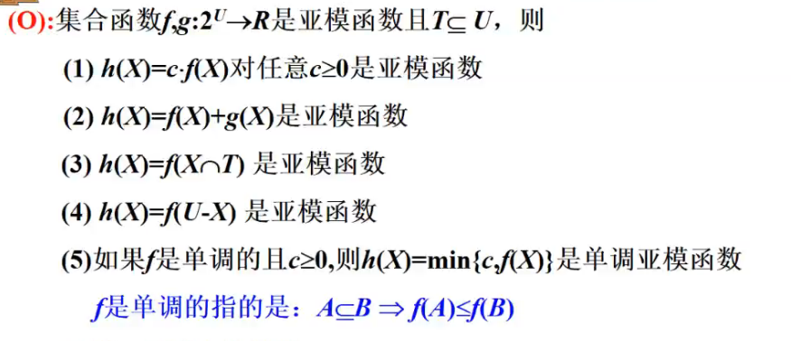

# 近似算法

- [近似算法](#%e8%bf%91%e4%bc%bc%e7%ae%97%e6%b3%95)
  - [基本定义](#%e5%9f%ba%e6%9c%ac%e5%ae%9a%e4%b9%89)
    - [Ratio Bound](#ratio-bound)
    - [相对误差](#%e7%9b%b8%e5%af%b9%e8%af%af%e5%b7%ae)
    - [相对误差界](#%e7%9b%b8%e5%af%b9%e8%af%af%e5%b7%ae%e7%95%8c)
    - [近似模式](#%e8%bf%91%e4%bc%bc%e6%a8%a1%e5%bc%8f)
  - [组合优化](#%e7%bb%84%e5%90%88%e4%bc%98%e5%8c%96)
    - [顶点覆盖问题](#%e9%a1%b6%e7%82%b9%e8%a6%86%e7%9b%96%e9%97%ae%e9%a2%98)
  - [贪心策略](#%e8%b4%aa%e5%bf%83%e7%ad%96%e7%95%a5)
  - [局部优化](#%e5%b1%80%e9%83%a8%e4%bc%98%e5%8c%96)
  - [动态规划](#%e5%8a%a8%e6%80%81%e8%a7%84%e5%88%92)
  - [线性规划](#%e7%ba%bf%e6%80%a7%e8%a7%84%e5%88%92)

## 基本定义

n:输入大小

C:A产生解的代价

C*:优化解的代价
### Ratio Bound

$$p(n)=max(C^*/C ,C/C^* )$$
### 相对误差

$$ |C-C^*|/C^*$$

### 相对误差界

$$ |C-C^*|/C^*\leq\epsilon(n) $$

$$\epsilon(n)\leq q(n)-1$$

### 近似模式

$$ A(I,\epsilon) $$

时间复杂度为|I|大的多项式

$$完全多项式~(1/\epsilon(n),I)$$

## 组合优化
### 顶点覆盖问题
Q:最少顶点覆盖所有边

A:
APPROX-Vertex-Cover (G)
1. C=0
2. E’=E\[G\];
3. While  E'!=0 do
4. 任取(u, v)E’;
5. C=C{u, v};
6. 从E’中删除所有与u或v相连的边;
7. Roturn C

A：第4步的边

$$|A|\leq|C^*|$$
$$|C|=2|A|\leq2|C^*| $$
$$|C|/|C^*|\leq2 $$

近似比为2

### 装箱问题

输入：体积a1,a2...an=(0,1]的n个物品，无穷个体积为1的箱子

输出：使用箱子数量最小

$$ \Sigma a_i \leq k^* $$

近似比为2

### 最短并行调度问题

Tstart+t=T

$$ Tstart \leq T^* $$

近似比为2

### 哈密顿环问题

输入：权值满足三角不等式的完全无向图

输出：具有最小代价的哈密顿环

最小生成树再最小图匹配

### 子集和

输入：(S,t)

输出：子集和不超过t的最大值

#### 指数时间算法

所有子集的和

每增加一个元素，新集合的子集为P&(P+x),最大时间复杂性为2|P|

指数增长：链表的成倍增长

#### 近似算法

使用代表元素

相对误差小于某个阈值

修剪：保留x1不断修建，trim(L,s/n)

算法：
1. 合成链表
2. 修剪
3. 删除大于t

|L|<=a(n,1/s)

## 贪心策略
### 集合覆盖问题

输入：有限集，子集族

输出：最小集合族

#### 基本思想

能覆盖最多的

近似比为ln(x+1)

### 不相交路径问题

输入：G，源顶点集S，汇顶点集T

输出：无公共边路径顶点对

#### 贪心思想

一个顶点对用的边最少的。

多次调用最短路径

#### 近似比

为根号m（边数）

参数化方法分析近似比

S*:精确解中长度小于k的路径|S*|<=k|A|

L*:精确解中长度大于k的路径|L*|<=(m/k)|A|

L*:的长度大于k，小于k|L*|<=m

相交条数小于等于k

### 亚模函数

1. 函数值边缘收益小（在大集合得到的函数值小）
2. 自变量运算小于函数值运算（凸函数）

#### 性质

eg: 
1. 权值和
2. 预算
3. 秩函数
4. 覆盖函数
5. 割函数

#### 亚模函数的最大化贪心算法

增益最大的元素

近似比大约为1.6
## 局部优化

对可行解进行局部优化得到局部优化解

多项式时间内必能拿到局部优化解

### 关键点

1. 给出可行解
2. 优化方式

## 动态规划

### 近似策略
1. 转换为特殊实例
2. 枚举解空间的部分解

### 01背包问题的完全多项式近似模式

bij:i到n获得价值为j的背包所需的最小重量

bij=min(bi+1j,bi+1j-vi+wij)

### bin-pack问题

输入：n个体积小于1的物品

输出：装箱方案

#### 解决方案

1. 放弃小物品，得到精确解
2. 加入小物品得到近似解

I':小于s的物品

Iup:将物品从小到大排序，分为1/s^2份，取最大的

Idown：取最小的

## 线性规划

线性优化问题的整数优化问题有天然的关系

最大化<最优解<最小化

### 对偶问题

1. 两边同时乘以非负数
2. 相加正则化，得到对偶问题

原问题

min cx

Ax>=b

x>=0

对偶问题

bTy

ATy<=CT

y>=0

可行解变为最优解的条件：

满足对偶问题条件的等号

$$ xj=0或\Sigma_i a_{ij}yi=cj$$

$$ yi=0或\Sigma_j b_{ij}xj=ci $$

#### 近似条件

使用时将a或b定为1

#### 最大流问题

流入小于等于流出

守恒约束下流量最大化

##### 顶点覆盖问题舍入法

给每条边一个权值，以前的随机方法不再适用

在覆盖中x(v)=1否则为0

w(v)x(v)>=b

x(u)+x(v)>=1

x(v)取0或1

对线性规划的结果进行四舍五入

##### 集合覆盖问题原偶模式

1. 对偶拟合方法：
    1. 贪心策略：第一次覆盖的平局权值最小的
    2. 在给出解决策略时给出对偶问题的可行解
2. 舍入法：
    1. 给出元素的频率（在集合族中出现的次数）给出最大频率，xs>=1/f时xs=1
    2. 随机舍入法rand>1-xs
3. 原偶模式

x:集合对应

y：元素对应

取未被覆盖的元素e0

ye0-> 使等号成立

等号成立的xs=1，加入这些元素

近似比：a=1,b=f

组合规划