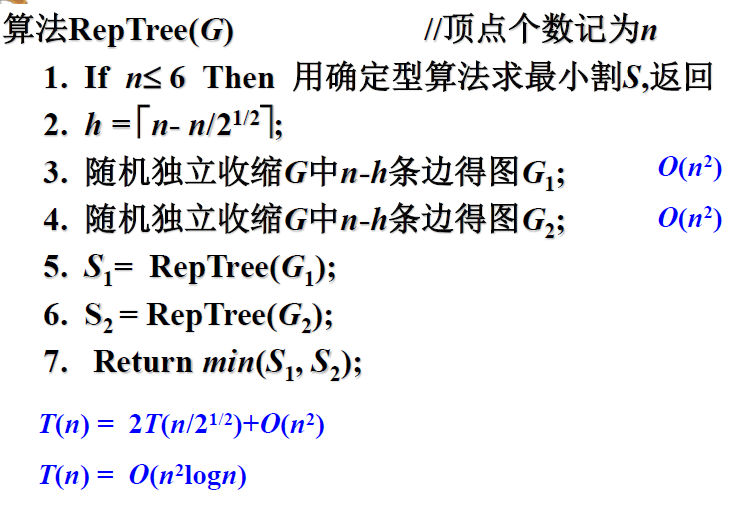

# 随机算法
- [随机算法](#%e9%9a%8f%e6%9c%ba%e7%ae%97%e6%b3%95)
  - [随机算法简介：](#%e9%9a%8f%e6%9c%ba%e7%ae%97%e6%b3%95%e7%ae%80%e4%bb%8b)
  - [分类](#%e5%88%86%e7%b1%bb)
    - [数值概率算法](#%e6%95%b0%e5%80%bc%e6%a6%82%e7%8e%87%e7%ae%97%e6%b3%95)
    - [蒙特卡洛(Monte Carlo)算法](#%e8%92%99%e7%89%b9%e5%8d%a1%e6%b4%9bmonte-carlo%e7%ae%97%e6%b3%95)
    - [拉斯维加斯(Las Vegas)算法](#%e6%8b%89%e6%96%af%e7%bb%b4%e5%8a%a0%e6%96%aflas-vegas%e7%ae%97%e6%b3%95)
    - [舍伍德(Sherwood)算法](#%e8%88%8d%e4%bc%8d%e5%be%b7sherwood%e7%ae%97%e6%b3%95)

## 随机算法简介：

较之那些我们所知的解决同一问题最好的确定性算法，随机算法所需的运行时间或空间通常小一些。

随机算法比较易于理解和实现（呵，站着说话不腰疼）。

随机算法的基本特征：对所求解问题的同一实例用同一随机算法求解两次可能得到完全不同的效果。这两次求解所需的时间、所得到的结果可能会有相当大的差别。

## 分类

### 数值概率算法

常用于数值问题的求解。这类算法所得到的往往是近似解且近似解的精度随计算时间的增加而不断提高。在许多情况下,要计算出问题的精确解是不可能的,或者没有必要,此时,用数值概率算法可以得到相当满意的解。

eg:求 pi

#### 计算定积分

f(x)=1/(b-a)

g*(x)=g(x)/f(x)

$$ 1/n \Sigma^n_{i=1}(b-1)g(\alpha_i) $$

### 蒙特卡洛(Monte Carlo)算法

用于求问题的准确解。对于许多问题来说,近似解毫无意义。

例如,一个判定问题其解为“是”或“否” ,二者必居其一,
不存在任何近似解。

又如,我们要求一个整数的因子,这样问题的解答必须是准
确的,一个整数的近似因子没有任何意义。

用蒙特卡洛算法能求得问题的一个解,但这个解未必是正确的。求得正确解的概率依赖于算法所用的时间,算法所用的时间越多,得到正确解的概率就越高。蒙特卡洛算法的主要缺点也在于此,即无法有效地判定所得到的解是否肯定正确。

eg:素数测试随机算法

#### 单面错误（MC1）双面错误（MC2）

### 拉斯维加斯(Las Vegas)算法

拉斯维加斯算法不会得到不正确的解。一旦用拉斯维加斯算法找到一个解,这个解就一定是正确解。但有时用拉斯维加斯算法会找不到解。与蒙特卡洛算法类似,拉斯维加斯算法找到正确解的概率随着它所用的计算时间的增加而提高。对于所求解问题的任一实例,用拉斯维加斯算法反复对该实例求解足够多次,可使求解失效的概率任意小。

eg：随机选择算法:

### 舍伍德(Sherwood)算法
舍伍德算法总能求得问题的一个解,且所求得的解总是正确的。当一个确定性算法在最坏情况下的计算复杂性与其在平均情况下的计算复杂性有较大差别时,可在这个确定性算法中引入随机性,将它改造成一个舍伍德算法,消除或减少问题的好坏实例间的这种差别。

最典型的例子就是随机化快排

## 最小割问题

输入：图

输出：最小割（最大流）

### 思想

随机收缩一条边，G至少有kn/2条边

### 改进

1. 简单重复O(n3)
2. 重复关键操作

