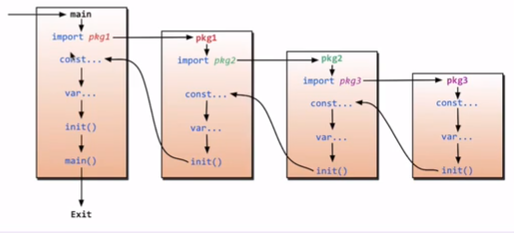
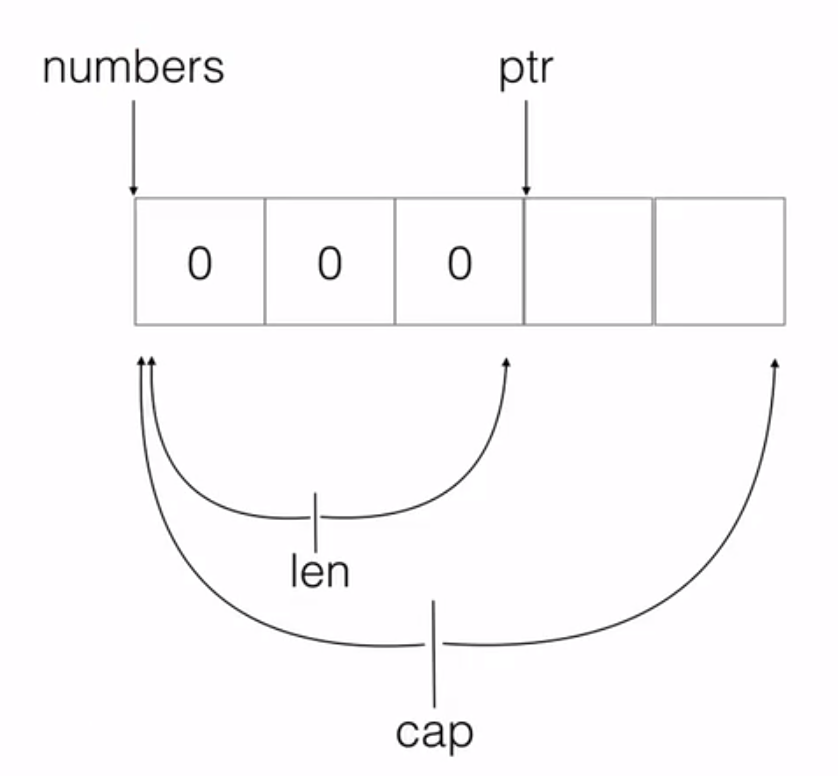

# 变量声明

## 完整声明

    var a int

有默认值

## 声明并初始化

    var a int = 100

## 简化声明

    var a = 100

## 最简声明

    a:=100

## 多重变量声明

    var a,b,c,=1,"ss",true

    var (
        a int = 10
        b string="ss"
    )

# 函数

    // r1 r2的默认值为0
    func foo1(a,b,c,e int)(r1 int,r2 string){

    }

# import与init函数

首字母大写表示接口对外开放

现在要完整路径才能正确导入包

所有包都要init函数

## 匿名别名

只使用init方法

    import _ "baoming"

## 别名

    import aa "baoming"

## 全部导入

    import . "baoming"

# defer

程序最后执行的语句

    defer fmt.Println("1")
    defer fmt.Println("2")

    输出 2 1

执行过程符合程序栈的习惯

## defer 与 return

return 早于 defer 执行

return有两个动作，先进行值返回，再执行defer，最后执行RET退出函数

# slice

## 数组

    var array [10] int

### 赋值

#### 索引赋值

    array[i]=k

#### 直接赋值

    array := [10] int {1,2,3,4}

### 在函数中的使用

本身长度不同数据类型不同，只能传同类型的参数

值传递

## 动态数组

    array：= []int{}

### 在函数中的使用

传指针

## Slice

    var numbers = make([]int,3,5)

    len=3,cap=5

### 追加

    numbers = append(numbers,1)

    容量不满时，值增加len不增加cap

    容量满时重新开辟2*cap的容量复制进去,这里的cap时当前的cap

### 新切片

    s1:=ss[0:2]

s1首地址与ss相同

    s1:=make([]int,3)

    copy(s1,ss)

# map

是一种哈希表(使用过程中为指针的副本)

## 声明与赋值
第一种

    var myMap map[string]string

    myMap=make(map[string]string,10)

第二种

    myMap:=make(map[string]string)

第三种

    myMap:=make(map[string]string){
        "one": "php"
    }

## 使用

添加

    mayMap["two"]="python"

遍历

    for key,value:=range myMap

删除

    delete(myMap,"one")

修改

    myMap["one"]="opo"

# 结构体

    type Oop struct {

    }

    var oop1 Oop

fun(oop1 Oop):是值传递

## 类

通过结构体绑定方法

    func (t *Oop) show{

    }

不建议使用this和self

    oop1.show()

### 注意

类名首字母大写表示可以在其他包访问

类内属性首字母大写表示可以在类外访问，否则只能在类内访问

方法名首字母大写可以在包外访问，首字母小写在包内访问

### 继承

    type NewOop struct {
        Oop
        level int
    }

#### 使用

    var oop2 NewOop

### 多态

父类使用子类方法

#### interface
interface 本质上是一个指向具体类型和方法的指针
    type AnimalIF interface {
        Sleep()
        GetColor()
        GetType()
    }

##### 使用

只要实现上述全部方法就使用了这个接口

# interface

interface{}:万能类型可以应用任意类型

## 判断是什么类型

类型断言
    arg interface{}

    value,ok:=arg.(string)

## 变量

type：static type(int,string),concrete type(interface指向的类型)二选一

value:

### 断言
相同静态类型可以通过断言转换

    type Reader interface{
        ReadeBook()
    }

    type Writer interface{
        WriteBook()
    }

    Type Book struct{

    }

    func (t *Book) ReadeBook(){

    }
    func (t *Book) ReadeBook(){

    }

    func main(){
        b:=&book{}

        var r Reader
        r=b

        r.ReadeBook()

        w=r.(Writer)
    }

# 反射

reflect包有两个函数

func ValueOf(i interface) Value {...}:返回数据中的值，若空则返回0
func TypeOf(i interface) Type {...}:返回数据中的类型，若空则返回nil，本身是一个断言

# 结构体标签

## 标签定义

    type resume struct{
        Name string 'info:"name" doc:"我的名字"'
        Sex string 'info:"sex"'
    }

## 获取

使用反射获取标签

## 使用

josn文件的编解码

orm映射关系

# 协程

1. 复用线程
2. 利用并行
3. 抢占
4. 全局G队列

## 复用线程

1. 偷取机制
2. 握手机制

### 偷取机制

队列无任务时从别的队列偷取任务

### 握手机制

一个协程阻塞，将任务队列委托给新唤醒的线程

## 利用并行

GOMAXPROCES：限定p的个数

## 抢占

10ms必须抢占

## 全局G队列

其他队列没有，无法偷取，从全局队列获取

## 创建goruntine

语法
    go task()

### 示例

    go func() {
        defer fmt.Println("A.defer")
    }()

## channel

### 定义

    make(chan,type,\<capacity>)

    channel<- value//传入

    s,ok:=channel//读出

#### 阻塞

必须有发送和接收才能正常进行，否则会发生阻塞

#### 有缓冲的通道

在未满和未空时不阻塞

### 关闭通道

    close(c)

#### 注意事项

1. 确定结束后才关闭channel
2. 关闭后无法再发送数据
3. 关闭后可以接收
4. nil channel 收发都会阻塞

### range

    for data:=range c{

    }

### select

    select{
        case <-chan1:
        csse chan2<- 1:
        default :
    }

# Go Modules

1. 依赖管理
2. 淘汰GOPATH
3. 统一社区的依赖管理

为了替代GOPATH

## GOPATH缺陷

无版本控制

无法同步一致第三方版本号

无法指定当前项目应用的第三方库版本号

## 模式

go mod init 生成go.mod文件
go mod download 下载 go.mod ⽂件中指明的所有依赖
go mod tidy 整理现有的依赖
go mod graph 查看现有的依赖结构
go mod edit 编辑 go.mod ⽂件
go mod vendor 导出项⽬所有的依赖到vendor⽬录
go mod verify 校验⼀个模块是否被篡改过
go mod why 查看为什么需要依赖某模块

### GO111MODULE

是否开启go modules模式，建议go V1.11之后，都设置为on

### GOPROXY

项⽬的第三⽅依赖库的下载源地址

direct ⽤于指示 Go 回源到模块版本的源地址去抓取（⽐如 GitHub 等）

### GOSUMDB

⽤来校验拉取的第三⽅库是否是完整的
默认也是国外的⽹站，如果设置了GOPROXY，这个就不⽤设置了

### GOPRIVATE 

覆盖GONOPROXY,GONOSUMDB

通过设置GOPRIVATE即可
go env -w GOPRIVATE="git.example.com,github.com/aceld/zinx
表示git.example.com 和 github.com/aceld/zinx是私有仓库，不会进⾏GOPROXY下载和校验

go evn -w GOPRIVATE="*.example.com"
表示所有模块路径为example.com的⼦域名，⽐如git.example.com 或者 hello.example.com 都不进⾏GOPROXY下载和校验

### 使用

### 初始化项⽬

任意⽂件夹创建⼀个项⽬（不要求在$GOPATH/src） mkdir -p $HOME/aceld/modules_test
创建go.mod⽂件，同时起当前项⽬的模块名称 go mod init github.com/aceld/module_test
就会⽣成⼀个go mod⽂件

    module github.com/aceld/moudles_test
    go 1.14

在该项⽬编写源代码
如果源代码中依赖某个库(⽐如: github.com/aceld/zinx/znet)

⼿动down 

    go get github.com/aceld/zinx/znet

⾃动down

go mod ⽂件会添加⼀⾏新代码

    module github.com/aceld/moudles_test
    go 1.14
    require github.com/aceld/zinx v0.0.0-20200315073925-f09df55dc746 // indirect

含义是当前模块依赖 github.com\/aceld\/zinx 依赖的版本是 v0.0.0-20200315073925-f09df55dc746

//indirect 表示间接依赖

因为项⽬直接依赖的是znet包所以所间接依赖zinx包

会⽣成⼀个go.sum⽂件

    github.com/aceld/zinx v0.0.0-20200315073925-f09df55dc746 h1:TturbcEfboY81jsKVSQtGkqk8FN8ag0TmKYzaFHflmQ=
    github.com/aceld/zinx v0.0.0-20200315073925-f09df55dc746/go.mod h1:bMiERrPdR8FzpBOo86nhWWmeHJ1cCaqVvWKCGcDVJ5M=
    github.com/golang/protobuf v1.3.3/go.mod h1:vzj43D7+SQXF/4pzW/hwtAqwc6iTitCiVSaWz5lYuqw=

go.sum⽂件的作⽤ 罗列当前项⽬直接或间接的依赖所有模块版本，保证今后项⽬依赖的版本不会被篡改

h1:hash

表示整体项⽬的zip⽂件打开之后的全部⽂件的校验和来⽣成的hash
如果不存在，可能表示依赖的库可能⽤不上
xxx/go.mod h1:hash go.mod⽂件做的hash

### 修改项⽬模块的版本依赖关系
    go mod edit -replace=zinx@v0.0.0-20200306023939bc416543ae24=zinx@v0.0.0-20200221135252-8a8954e7510