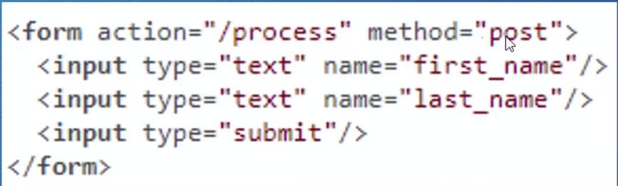
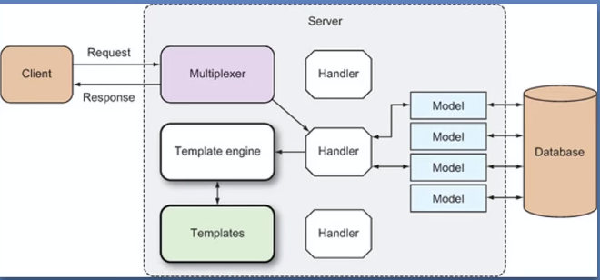

# Handle请求

## 简单使用

    http.ListenAndServe("localhost:8080", nil)

nil：defaultServeMux--->接收请求，自动导航，所有请求统一处理

### defaultServeMux

本身是一个Handle实现了Handle的方法，实现方法如下

    func (mux *ServeMux) ServeHTTP(w ResponseWriter, r *Request) {
    	if r.RequestURI == "*" {
    		if r.ProtoAtLeast(1, 1) {
    			w.Header().Set("Connection", "close")
    		}
    		w.WriteHeader(StatusBadRequest)
    		return
    	}
    	h, _ := mux.Handler(r)
    	h.ServeHTTP(w, r)
    }

## 灵活的方法

    server := http.Server{
        Addr:    "127.0.0.1:8080",
        Handler: nil,
    }

    server.ListenAndServe()

## myHandle

只要实现ServeHTTP(w http.ResponseWriter, r *http.Request)这个方法就可以作为Han

    type myHandle struct{}

    func (*myHandle) ServeHTTP(w http.ResponseWriter, r *http.Request)  {

    	w.Write([]byte("hello world"))

    }

## 多个Handler

使用http.Handle将某个Handler加入到defaultServeMux中

    func Handle(pattern string, handler Handler) { DefaultServeMux.Handle(pattern, handler) }

example

    http.Handle("/hello",&mh)

### Handler函数

和Handle行为类似的函数

参数与ServeHTTP(w http.ResponseWriter, r *http.Request)相同

#### handleFunc

将具有适当签名的函数f适配成一个Handler，使其具有方法f

    http.handleFunc("/home",func Home(w http.ResponsWriter,r *http.Request){
        w.Write([]byte("Home"))
    })

    http.handleFunc("/Welcome",welcome)
    //相同调用

    http.handle("/Welcome", http.handlerFunc(welcome))
    //其中http.handlerFunc是一个类型

## 内置Handler

## NotFundHandler

http.NotFundHandler()Handler 返回404

## RedirectHandler

http.RedirectHandler(url string,code int) Handler

把请求使用状态码，转到URL

## StripPrefix

http.StripPrefix(prefix string, h handler) Handler

返回一个handler,从请求的URL中去掉指定的前缀，调用相应的handler

## TimeoutHandler

http.TimeoutHandler(h Handler,dt time.DUration,msg string) Handler

再指定时间内传入h

## FileServer

http.FileServer(root FileSystem) Handler

基于root的文件系统

一般委托给Dir，使用操作系统的文件系统

## 例子

    http.ListenAndServe(":8080",http.FileServer(http.Dir("")))

# http消息

HTTP Request HTTP Response

有相同结构

## Request

URL：请求行的部分内容

URL是指向url.URL的一个指针

结构如下

    type URL struct {
    	Scheme      string
    	Opaque      string    // encoded opaque data
    	User        *Userinfo // username and password information
    	Host        string    // host or host:port
    	Path        string    // path (relative paths may omit  leading slash)
    	RawPath     string    // encoded path hint (see EscapedPath     method)
    	ForceQuery  bool      // append a query ('?') even if   RawQuery is empty
    	RawQuery    string    // encoded query values, without '?'
    	Fragment    string    // fragment for references, without '#'
    	RawFragment string    // encoded fragment hint (see     EscapedFragment method)
    }

通用形式

    [scheme:][//[userinfo@]host][/]path[?query][#fragment]

不以斜杠开头

    scheme:opaque[?query][#fragment]

### query查询字符串

通常用于get请求

r.URL.RawQuery:得到原始字符串

r.URL.Query():得到map\[string][]string

r.URL.Query().Get():返回名字对相应的第一个值

### Fragment

浏览器会去掉Fragment，但部分http客户端会保存

### Rerquest Header

描述HTTP Header里的Key-Value对，Key是String，value是[]string

### Request Body

实现了io.ReaderCloser是一个Reader接口，一个Closer接口，

## form 

action：处理路径

method：表名请求种类

input：name-value对 enctype:指定数据对格式简单为本用URL编码，大量数据用MIME

GET：没有body

### 提取数据

Request上的函数允许我们从URL或/和Rody中提取字段

Form：key-value对(map\[string][]string),表单里的值靠前，URL的值靠后,只支持（application/x-www-form-urlencoded）

向掉以哦那个ParseForm或ParseMutipartForm解析Request，再访问相应字段

PostForm：只提供表单里的数据只支持（application/x-www-form-urlencoded）

提取其他类型的数据

MultipartForm：只有表单的key-value对，返回的是有两个map的struct(map\[string]string，map\[string]file)，

先调用ParseMUltipartForm方法，

#### FormValue,PostFormValue

FormValue：只取一个值

PostForm：只取表单一个值

不能应用于（Multipart/form-data）

### 上传文件

1. 解析表单，获取文件名
2. open文件
3. ioutil.ReadAll(file)转为byte slice写入ResponseWriter

FormFile():获得文件名

### MutipartReader

逐个检查每次处理一个

## Post请求

不是所有的POST请求都来自Form

## ResponseWriter

从服务器向客户端返回相应，本身是一种接口，handler用它来返回响应，幕后的struct是http.response

ServeHTTP(w http.ResponseWriter, r *http.Request)中的http.ResponseWrite是一个接口，调用时本身就是一个指针

### 写入

Write方法，header没有content type则数据的前512个字节用以检测content type

#### WriteHeader

接收状态码，并作为响应返回，调用后无法再修改header

#### Header

返回headers的map，可修改

## 内置Response

NoFound函数：返回404
ServerFile函数：从文件系统提供文件
ServerContent函数：实现io.ReadSeeker的任何东西
Rediect函数：重定向到另一个URL

# 模板

## 什么时模板

Web模板时设计好的HTML页面，可以反复使用

text/template,html/template

## 理想中的模板引擎

无逻辑模板引擎：只做字符串替换

逻辑嵌入模板引擎：编程语言嵌入模板中

## go的模板引擎

1. 有handler触发模板引擎
2. handler调用引擎传入模板和动态数据
3. 生成的HTML传入ResponsWriter
4. 写入HTTP响应

## 模板

通常为HTML文件，回嵌入一些命令（action）

{{.}}这里的.就是一个action

## 使用

1. 解析模板源
2. 传入ResponsWriter和数据

### 模板解析

#### ParseFiles

解析文件

根据模板文件，创建一个新的模板

#### ParseClob

按模式匹配文件进行解析

#### Parse

解析字符串，所有方法最终都会

#### Lookup

通过模板名寻找(map)

#### Must

返回一个模板指针和一个错误

### 执行模板

Execute(ResponseWriter,string)

ExcuteTemplate(w,模版名，string)

### example

    func main(){
        template:=loadTemplates()
        http.handlerFunc("/",func(w http.ResponseWriter,r *http.Request){
            filename:=r.URL.Path[1:]

            if t!=nil{
                err := t.Execute(w,nil)
                if err !=nil{
                    log.Fatalln(err.Error())
                }
            }else{
                w.WriteHeader(http.StatusNotFound)
            }
        })

        http.Handle("/css/",http.FileServer(http.Dir("")))
        http.Handle("/img/",http.FileServer(http.Dir("")))
        http.ListenAndServe("localhost:8080", nil)
    }
    
    func loadTemplates()*templat.Tamplte{
        result := template.New("template")
        template.Must(result.ParseClob("template/*.html"))
        return result
    }

## action

### 条件类

{{if arg}}

some cont

{{else}}

some cont

{{end}}

#### 逻辑运算符
eq/ne
lt/gt
le/ge
and
or 
not

### 遍历类

{{range array}}

dot is set to the element {{.}}

{{else}}  回落机制

{{end}}

### 设置

{{with arg}}

Dot is set to arg

{{else}}

{{end}}

### 包含

{{template "name" arg}}

### block

{{block "name}}

{{name}}

与temlate相同但其中的name可以不存在，输出

## 函数与管道

### 设置变量

$varable:=value

### 管道

按顺序联系到一起的参数函数方法

{{p1|p2|p3}}

### 函数

可以接收任意数量的参数，但只能返回一个值一个错误

### 内置函数

#### define

设置模板名字

#### index

index slice 0：取出0的值

#### len

返回长度

#### with

### 自定义函数

template.Funcs(funcMap FuncMap) *Templat

type FuncMap map\[string]interface{}

value是函数

1. 创建一个FuncMap(map)
2. 把FuncMap加到模板

template.New("").Funcs(funcMap).Parse()

建议使用管道

## 组合模板

layout模板就是网页中固定的部分

# 数据库编程