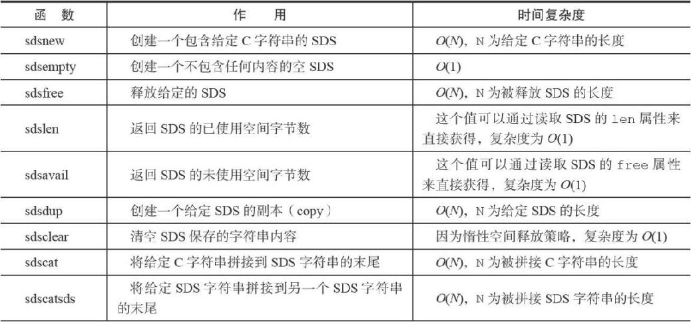
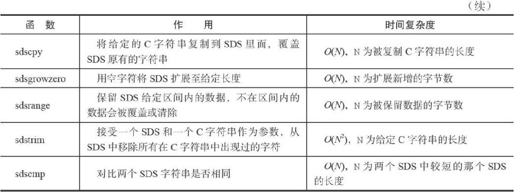
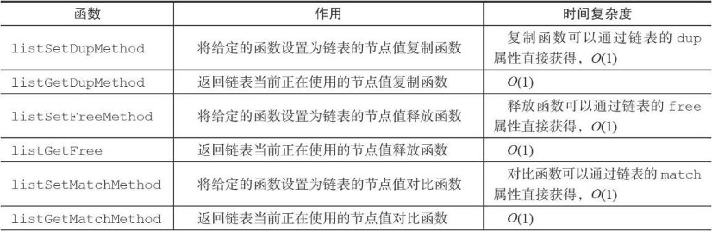
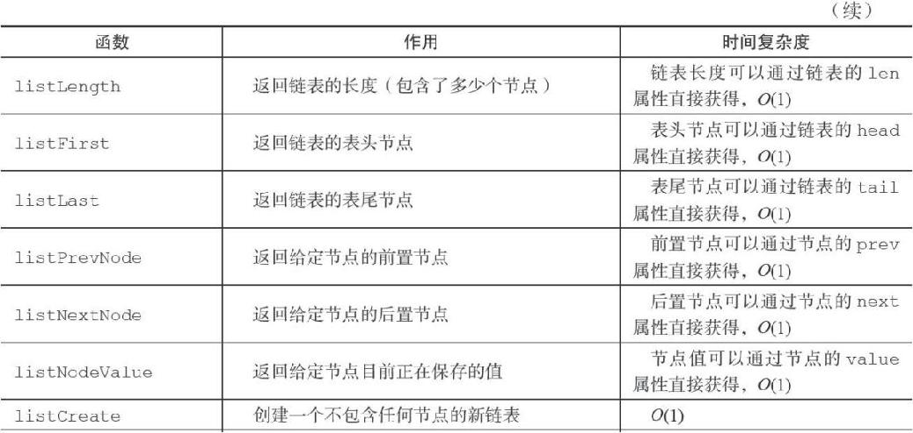
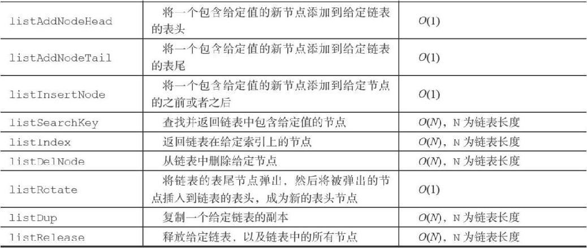
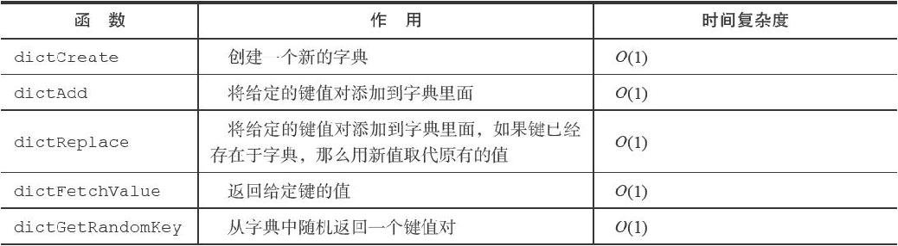
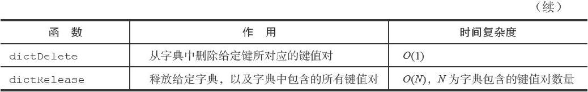
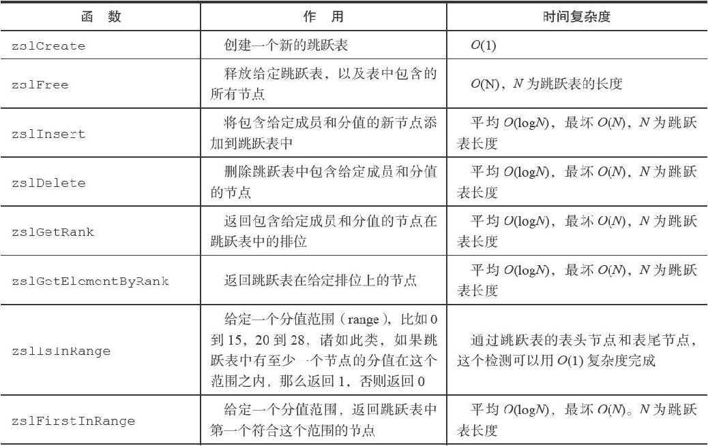
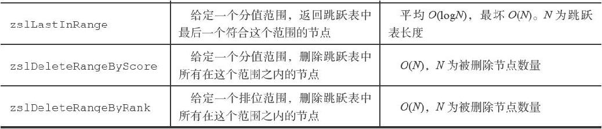
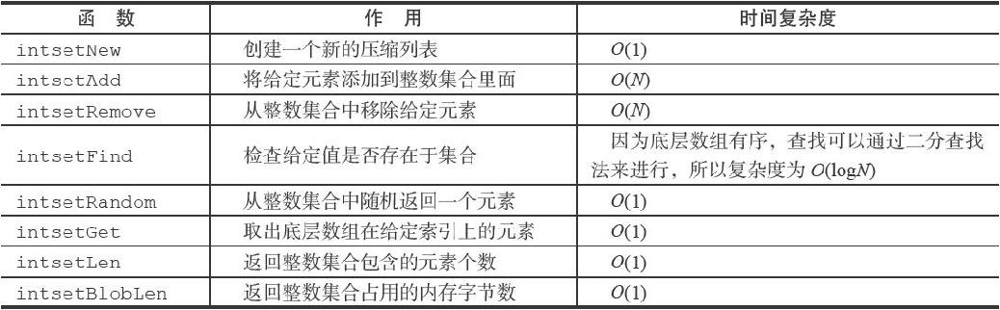

# SDS(simple dynamic string)

## 结构
***
struct sdshdr {
    int len;//记录buf数组中已使用字节的数量等于SDS所保存字符串的长度
    int free;//记录buf数组中未使用字节的数量
    char buf[];// 字节数组，用于保存字符串
};
***

在golnag中可以直接用byte切片代替

## 与字符串数组的区别

1. 获取长的时间复杂度为O(n)
2. 使用free杜绝缓存区溢出的可能
3. 减少修改时的内存重分配

SDS进行空间扩展的时候为SDS分配额外的未使用空间具体规则如下：

SDS的长度（也即是len属性的值）将小于1MB，那么程序分配和len属性同样大小的未使用空间

如果对SDS进行修改之后，SDS的长度将大于等于1MB，那么程序会分配1MB的未使用空间

缩短SDS保存的字符串时，程序并不立即使用内存重分配来回收缩短后多出来的字节，而是使用free属性将这些字节的数量记录起来，并等待将来使用

4. 二进制安全（二进制处理数据，可以保存特殊字符如'\0','\n'）
5. 兼容一部分c字符串函数

## 操作

# 链表

## 结构

***
typedef struct listNode {

    struct listNode * prev;// 前置节点
    struct listNode * next;// 后置节点
    
    void * value;// 节点的值
}listNode;
***

双端链表

***
typedef struct list {
    
    listNode * head;// 表头节点
    
    listNode * tail;// 表尾节点
    
    unsigned long len;// 链表所包含的节点数量
    
    void *(*dup)(void *ptr);// 节点值复制函数
    
    void (*free)(void *ptr);// 节点值释放函数
    
    int (*match)(void *ptr,void *key);// 节点值对比函数
} list;

***

1. dup函数用于复制链表节点所保存的值；
2. free函数用于释放链表节点所保存的值；
3. match函数则用于对比链表节点所保存的值和另一个输入值是否相等。

## 特性

双端：链表节点带有prev和next指针，获取某个节点的前置节点和后置节点的复杂度都是O（1）。

无环：表头节点的prev指针和表尾节点的next指针都指向NULL，对链表的访问以NULL为终点。

带表头指针和表尾指针：通过list结构的head指针和tail指针，程序获取链表的表头节点和表尾节点的复杂度为O（1）。

带链表长度计数器：程序使用list结构的len属性来对list持有的链表节点进行计数，程序获取链表中节点数量的复杂度为O（1）。

多态：链表节点使用void*指针来保存节点值，并且可以通过list结构的dup、free、match三个属性为节点值设置类型特定函数，所以链表可以用于保存各种不同类型的值。

## 操作

# 字典

## 结构

***
typedef struct dictEntry {
    
    void *key;// 键
    
    union{
        void *val;
        uint64_tu64;
        int64_ts64;
    } v;// 值
    
    struct dictEntry *next;// 指向下个哈希表节点，形成链表
} dictEntry;
***

key属性保存着键值对中的键，而v属性则保存着键值

对中的值，其中键值对的值可以是一个指针，或者是一个uint64_t整数，又或者是一个int64_t整数。

***

typedef struct dictht {
    
    dictEntry **table;//哈希表数组
    
    unsigned long size;// 哈希表大小

    unsigned long sizemask; //哈希表大小掩码，用于计算索引值总是等于size-1
    unsigned long used;// 该哈希表已有节点的数量
} dictht;

***

table属性是一个数组，数组中的每个元素都是一个指向dictEntry结构的指针

***

typedef struct dict {
    
    dictType *type;// 类型特定函数
    
    void *privdata;// 私有数据
    
    dictht ht[2];// 哈希表

    in trehashidx; /* rehashing not in progress if rehashidx == -1 */
} dict;

***

type属性是一个指向dictType结构的指针，每个dictType结构保存了一簇用于操作特定类型键值对的函数，Redis会为用途不同的字典设置不同的类型特定函数。

privdata属性则保存了需要传给那些类型特定函数的可选参数。

typedef struct dictType {
    
    unsigned int (*hashFunction)(const void *key);// 计算哈希值的函数
    
    void *(*keyDup)(void *privdata, const void *key);// 复制键的函数
    
    void *(*valDup)(void *privdata, const void *obj);// 复制值的函数
    
    int (*keyCompare)(void *privdata, const void *key1, const void *key2);// 对比键的函数
    
    void (*keyDestructor)(void *privdata, void *key);// 销毁键的函数
    
    void (*valDestructor)(void *privdata, void *obj);// 销毁值的函数
} dictType;

ht属性是一个包含两个项的数组，数组中的每个项都是一个dictht哈希表，一般情况下，字典只使用ht\[0]哈希表，ht\[1]哈希表只会在对ht\[0]哈希表进行rehash时使用。

rehashidx记录了rehash目前的进度，如果目前没有在进行rehash，那么它的值为-1。

## 计算哈希值

使用字典设置的哈希函数，计算键key的哈希值 hash = dict->type->hashFunction(key);

使用哈希表的sizemask属性和哈希值，计算出索引值根据情况不同，ht\[x]可以是ht\[0]或者ht\[1] index = hash & dict->ht\[x].sizemask;

MurmurHash2算法

## 键冲突

添加到对应哈希值的表头位置

## rehash

1）为字典的ht\[1]哈希表分配空间，这个哈希表的空间大小取决于要执行的操作，以及ht\[0]当前包含的键值对数量（也即是ht\[0].used属性的值）：

·如果执行的是扩展操作，那么ht\[1]的大小为第一个大于等于ht[0].used*2的2的n次方幂；

·如果执行的是收缩操作，那么ht\[1]的大小为第一个大于等于ht\[0].used的2的n次方。

2）将保存在ht\[0]中的所有键值对rehash到ht\[1]上面：rehash指的是重新计算键的哈希值和索引值，然后将键值对放置到ht\[1]哈希表的指定位置上。

3）当ht\[0]包含的所有键值对都迁移到了ht\[1]之后（ht\[0]变为空表），释放ht\[0]，将ht\[1]设置为ht、[0]，并在ht\[1]新创建一个空白哈希表，为下一次rehash做准备。

扩展条件：

1. 没有在执行BGSAVE命令或者BGREWRITEAOF命令，并且哈希表的负载因子大于等于1
2. 正在执行BGSAVE命令或者BGREWRITEAOF命令，并且哈希表的负载因子大于等于5。

load_factor = ht\[0].used / ht\[0].size

收缩条件：

哈希表的负载因子小于0.1

### 渐进式rehash

1. 为ht[1]分配空间，让字典同时持有ht[0]和ht[1]两个哈希表。
2. 在字典中维持一个索引计数器变量rehashidx，并将它的值设置为0，表示rehash工作正式开始。
3. 在rehash进行期间，每次对字典执行添加、删除、查找或者更新操作时，程序除了执行指定的操作以外，还会顺带将ht[0]哈希表在rehashidx索引上的所有键值对rehash到ht[1]，当rehash工作完成之后，程序将rehashidx属性的值增一。
4. 随着字典操作的不断执行，最终在某个时间点上，ht[0]的所有键值对都会被rehash至ht[1]，这时程序将rehashidx属性的值设为-1，表示rehash操作已完成。

在渐进式rehash进行期间，字典的删除（delete）、查找（find）、更新（update）等操作会在两个哈希表上进行。

在渐进式rehash执行期间，新添加到字典的键值对一律会被保存到ht[1]里面，而ht[0]则不再进行任何添加操作，

## 操作

# 跳跃表

跳跃表（skiplist）是一种有序数据结构，它通过在每个节点中维持多个指向其他节点的指针，从而达到快速访问节点的目的。

一般用来代替平衡树

Redis只在两个地方用到了跳跃表，一个是实现有序集合键，另一个是在集群节点中用作内部数据结构，除此之外，跳跃表在Redis里面没有其他用途。

## 结构

### node

typedef struct zskiplistNode {
    
    struct zskiplistLevel {
        
        struct zskiplistNode *forward;// 前进指针
        
        unsigned int span;// 跨度
    } level[];// 层,节点的层高都是1至32之间的随机数
    
    struct zskiplistNode *backward;// 后退指针
    
    double score;// 分值
    
    robj *obj;// 成员对象
} zskiplistNode;

前进指针用于访问位于表尾方向的其他节点，而跨度则记录了前进指针所指向节点和当前节点的距离。

后退（backward）指针：它指向位于当前节点的前一个节点。后退指针在程序从表尾向表头遍历时使用。‘

分值（score）：跳跃表中，节点按各自所保存的分值从小到大排列。

成员对象（obj）：节点所保存的成员对象的指针。

### 跳跃表

typedef struct zskiplist {
    
    structz skiplistNode *header, *tail;// 表头节点和表尾节点
    
    unsigned long length;// 表中节点的数量
    
    int level;// 表中层数最大的节点的层数
} zskiplist;

## 操作

# 整数集合

一个集合只包含整数值元素，并且这个集合的元素数量不多

## 结构

typedef struct intset {
    
    uint32_t encoding;// 编码方式
    
    uint32_t length;// 集合包含的元素数量
    
    int8_t contents[];// 保存元素的数组，按值的大小从小到大有序地排列，真正类型取决于encoding属性的值
} intset;

## 升级

新元素添加到整数集合里面，并且新元素的类型比整数集合现有所有元素的类型都要长时，整数集合需要先进行升级

1. 根据新元素的类型，扩展整数集合底层数组的空间大小，并为新元素分配空间。
2. 将底层数组现有的所有元素都转换成与新元素相同的类型，并将类型转换后的元素放置到正确的位上
3. 将新元素添加到底层数组

### 好处

1. 提升灵活性：整数集合可以通过自动升级底层数组来适应新元素
2. 节约内存

## 操作

# 压缩列表

列表键只包含少量列表项，并且每个列表项要么就是小整数值，要么就是长度比较短的字符串，那么Redis就会使用压缩列表来做列表键的底层实现。

## 结构