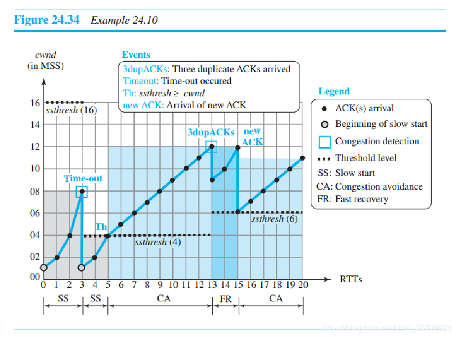

# 硬件基础

# 网络

## TCP/IP协议：传输层/网络层

TCP和UDP

### TCP NewReno与SACK 运行机制对比分析
1. Reno算法的缺点：Reno快速恢复算法中发送方收到一个新的ACK就退出快速恢复状态。但是在传送过程中，可能有多个包丢失。因为Reno仅仅更正了第一个包丢失的错误。在进入拥塞避免后，可能还要给上次没有完全修正的错误擦屁股。可能导致累计的错误在增多，而窗口在减小。终究导致窗口减少不够Duplicate ACK，从而超时。
2. New Reno算法：New Reno算法中只有当所有报文都被应答后才退出快速恢复状态。NewReno算法中有变量recover，其值为检测到丢包时的最大发送序列号。只有当recover之前的数据报都确认完后，才能退出快速恢复，进入拥塞避免阶段。
3. New Reno算法的缺点：每一个RTT时间内至多重传一个丢弃的包。这个是累计确认的锅。因为累计确认机制，当接收方接收到第一个缺失的包后，ACK第二个缺失的包，直到ACK的值等于recover才退出快速恢复计算，进入拥塞避免阶段。
4. SACK算法：可以进行选择重传和选择确认。传送端可以很明确地知道哪些封包已经被接收到了，并且直接针对遗失部分重传。灵活是有代价的，相对于3而言，正常情况要多传很多ACK。