## 逻辑门

### and

### or

### no

### xor

## AUL 计算单元

### 半加器

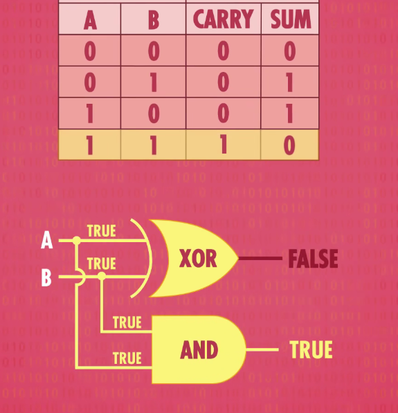

### 全加器

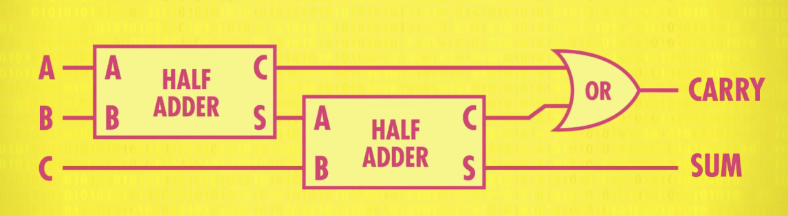

### 超前进位加法器

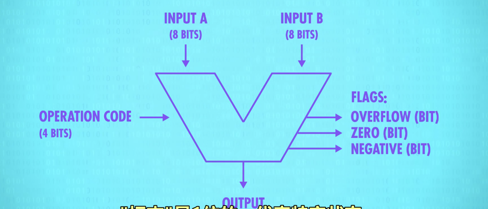

## 存储

### 锁存器

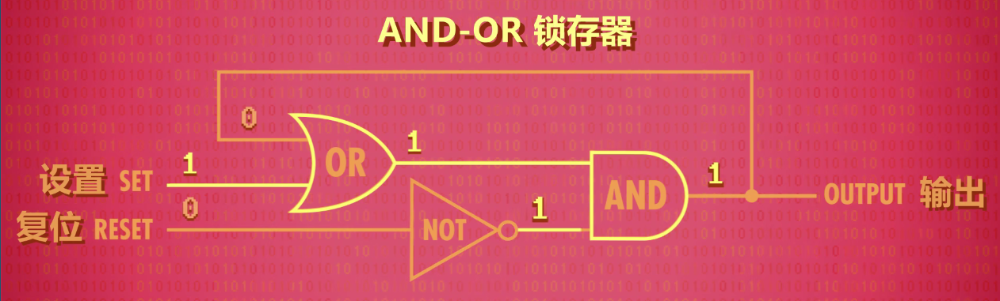

### 门锁

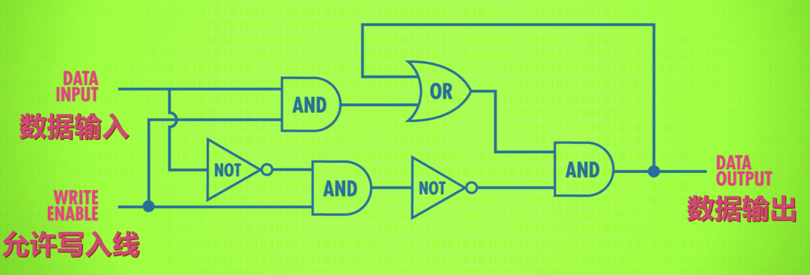

### 寄存器

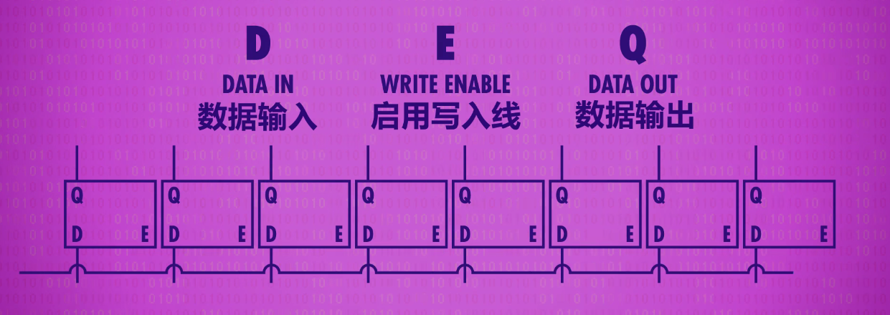

高位矩阵用矩阵方式排列启动

#### 多路复用器

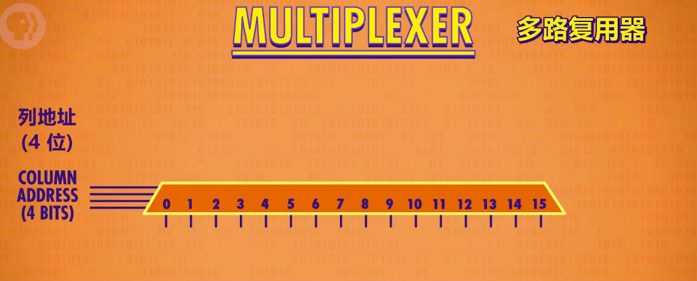

### SRAM

结构

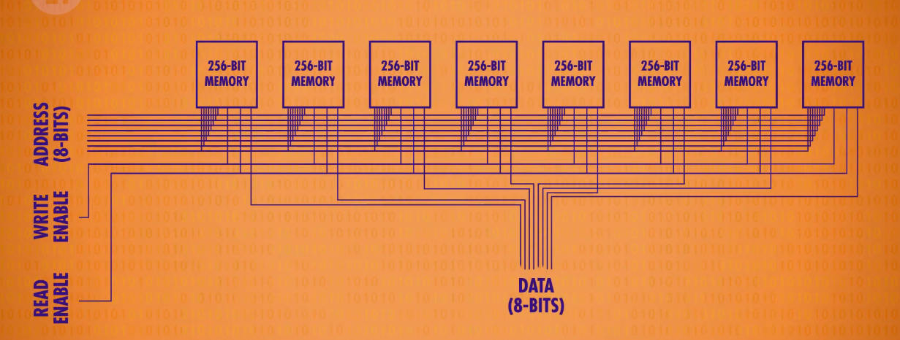

抽象

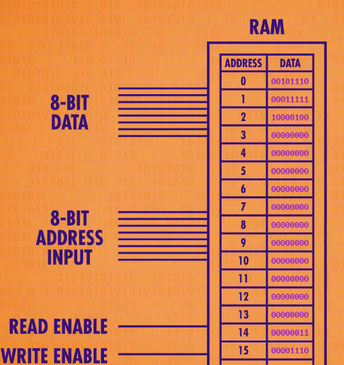

## CPU

1. 取指令
2. 解码
3. 执行

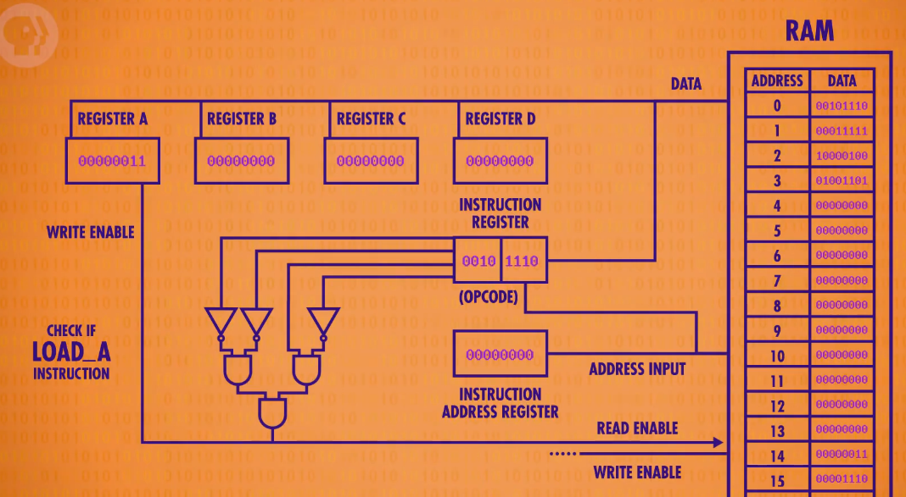

抽象

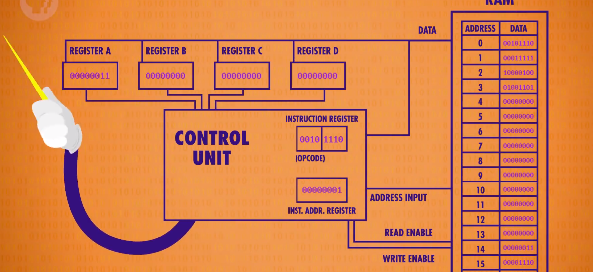

### 指令集

可变指令长度

### CPU设计

局部原理

#### 缓存

脏位，写回ram时检查脏位，进行同步

#### 流水线设计

##### 读写

重排指令顺序，乱序执行

##### JUMP

分支预测

推测执行

#### 超标量处理器

一个周期完成多条指令：使用多余的部分

## 冯诺依曼机

处理器+数据寄存器+指令寄存器+指令地址寄存器+内存

## 编程语言

### 机器码

### 汇编

汇编器读取汇编码转为机器码

### 高级语言

#### 编译原理

##### 语法

#### 语句

#### 函数

#### 面向对象编程

隐藏复杂性选择性公布功能

#### 注释和文档

#### 版本控制

#### 测试（QA）

## 操作系统

### 虚拟内存

#### 内存保护

### 多用户

分时操作系

### unix

内核恐慌:处理错误

### DOS
无多任务，虚拟内存，内存保护

## 存储介质

### 延迟线存储器

### 磁芯存储器

### 磁带

### 磁鼓存储器

### 硬盘和软盘

磁性读写

### 光盘

光的不同折射

### 固态

与ram相似

## 文件系统

### 文件格式

开头：元数据

### 存储

#### 文件目录

#### 分块

#### 目录嵌套

### 压缩
#### 无损压缩
1. 减少重复信息（）
2. 哈夫曼树

#### 有损压缩

1. 感知编码
2. 只保存改变

## 输入输出

### 卡纸 磁带

### 键盘

### shell

无限长的纸

### 图形界面

1. 矢量扫描
2. 光栅扫描

#### 字符生成器

屏幕缓存器

#### 矢量模式

所有都是线

#### 位图显示

## 3D图形

1. 三点确定一个平面
2. 扫面线算法
3. 抗锯齿（边缘颜色浅）

### 画家算法

由远及近依次涂色

### 深度缓冲

数字矩阵初始化为无限大

记录更小在的值

### 光线

#### 平面着色

### 纹理

对应坐标